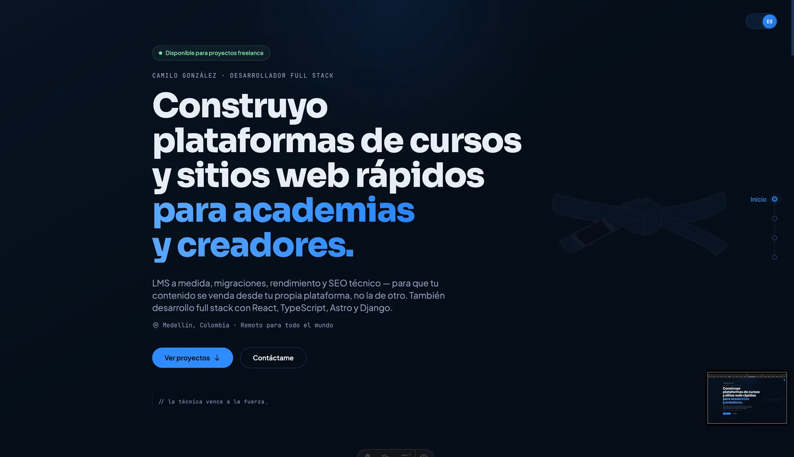

# Zeiko Portfolio

The personal portfolio of Camilo González (ZeikoDev), a full-stack developer based in Medellín, Colombia — focused on course platforms (LMS), migrations, and performance/SEO work for academies and content creators.

Built with Astro and shipped as a static site. Brazilian Jiu-Jitsu shows up as an accent — the belt mark, the "technique beats strength" motto — not as the theme of the interface.

## Features

- 🌐 **Multilanguage support (i18n)**: English and Spanish, with easy extensibility for more languages
- 🗂️ **Dynamic routing per language**: All main pages and project details live under `/en/` and `/es/`
- 📇 **Case studies**: Client work is written as problem → what I did → result, with detail pages for the longer ones
- ⚡ **No runtime UI framework**: Every section is a static Astro component; the site is its own performance demo
- 🎞️ **Animations without libraries**: CSS plus a single `IntersectionObserver` driving `data-reveal`, with `prefers-reduced-motion` respected
- 📱 Fully responsive layout
- 🎯 Smooth scroll navigation
- ✉️ Contact through an email modal, no backend required

## Tech Stack

- [Astro](https://astro.build) - Static site generation
- [Tailwind CSS](https://tailwindcss.com) - Utility-first CSS
- [TypeScript](https://www.typescriptlang.org) - Type safety
- [sharp](https://sharp.pixelplumbing.com) - Image optimization for project screenshots (`.webp`)

The `@astrojs/react` integration is still configured, but no React components remain in `src/` after the UI overhaul.

## Getting Started

### Prerequisites

- Node.js 18.0.0 or later
- npm or yarn

### Installation

1. Clone the repository:

   ```bash
   git clone https://github.com/ZeikoDev/zeiko-portfolio.git
   cd zeiko-portfolio
   ```

2. Install dependencies:

   ```bash
   npm install
   # or
   yarn install
   ```

3. Start the development server:

   ```bash
   npm run dev
   # or
   yarn dev
   ```

4. Open [http://localhost:4321](http://localhost:4321) in your browser.

### Building for Production

```bash
npm run build
# or
yarn build
```

The built files will be in the `dist` directory.

## Project Structure

```
zeiko-portfolio/
├── docs/                        # Repo-only assets (README preview)
├── public/                      # Static assets served as-is
│   ├── assets/icons/            # Tech icons used in the Skills section
│   ├── assets/projects/         # Project screenshots (.webp)
│   └── bjj-belt.svg             # Belt mark used as an accent
├── src/
│   ├── components/
│   │   ├── sections/            # Page sections
│   │   │   ├── Hero.astro
│   │   │   ├── TechMarquee.astro
│   │   │   ├── About.astro
│   │   │   ├── Skills.astro
│   │   │   ├── Projects.astro          # Client work
│   │   │   └── PersonalProjects.astro  # Side projects
│   │   └── ui/
│   │       ├── EmailModal.astro
│   │       └── buttons/JesseButton.astro
│   ├── data/
│   │   ├── projects.ts          # Client work (bilingual, problem/solution/result)
│   │   ├── personalProjects.ts  # Side projects
│   │   └── site.ts              # Contact email
│   ├── i18n/
│   │   ├── ui.json              # UI text translations
│   │   ├── utils.ts             # i18n helper functions
│   │   └── types.ts             # Type definitions for i18n
│   ├── layouts/
│   │   └── Layout.astro         # Shared head, styles and reveal-on-scroll script
│   └── pages/
│       ├── index.astro          # Root: client-side language redirect
│       └── [lang]/              # Dynamic language folder (en, es)
│           ├── index.astro      # Home page per language
│           └── proyectos/       # Project detail pages per language
│               ├── fondas-mi-pueblo.astro
│               ├── soy-consciente.astro
│               ├── itm.astro
│               ├── discotek.astro
│               ├── easylife.astro
│               ├── finances-dashboard.astro
│               └── inventory-dashboard.astro
├── astro.config.mjs             # Astro configuration (i18n, aliases, minification)
├── tailwind.config.mjs          # Tailwind configuration
└── package.json
```

Projects are data-driven: add an entry to `src/data/projects.ts` and it renders in the
Projects section. Set `hasDetailPage: true` and add a matching `.astro` file under
`proyectos/` when the project deserves a full case study.

## Internationalization (i18n)

- The site supports multiple languages using a dynamic `[lang]` route in `src/pages/[lang]/`.
- All main pages and project details are available under `/en/` and `/es/` (e.g., `/en/proyectos/itm`, `/es/proyectos/itm`).
- UI text is managed in `src/i18n/ui.json` and accessed via helper functions in `src/i18n/utils.ts`.
- The root `index.astro` performs a client-side redirect to the user's preferred language based on their browser settings.
- To add a new language, add translations to `ui.json` and create the corresponding `[lang]` folder structure.

### Example Routes

- `/en` - Home page in English
- `/es` - Home page in Spanish
- `/en/proyectos/itm` - ITM project detail in English
- `/es/proyectos/itm` - ITM project detail in Spanish

## Customization

### Colors

The color scheme can be customized in `tailwind.config.mjs`. The current theme uses:

- Deep navy backgrounds
- Electric blue accents
- White/light gray text

### Content

Most copy lives in `src/i18n/ui.json`, so both languages stay in sync. Everything else:

- `src/data/projects.ts` - Client work (name, tag, problem, solution, result, tech, image)
- `src/data/personalProjects.ts` - Side projects
- `src/data/site.ts` - Contact email
- `Hero.astro` / `About.astro` / `Skills.astro` - Section-specific markup and structure

Project screenshots go in `public/assets/projects/` as `.webp`, around 1600px wide.

## Development

### Available Commands

| Command                   | Action                                           |
| :------------------------ | :----------------------------------------------- |
| `npm install`             | Installs dependencies                            |
| `npm run dev`             | Starts local dev server at `localhost:4321`      |
| `npm run build`           | Build your production site to `./dist/`          |
| `npm run preview`         | Preview your build locally, before deploying     |
| `npm run lint`            | Lint `.js`, `.jsx`, `.ts`, `.tsx` and `.astro`   |
| `npm run format`          | Format the project with Prettier                 |
| `npm run astro ...`       | Run CLI commands like `astro add`, `astro check` |

## License

This project is licensed under the MIT License - see the [LICENSE](LICENSE) file for details.

## Acknowledgments

- Design elements inspired by modern web trends
- Icons from various open-source icon sets
